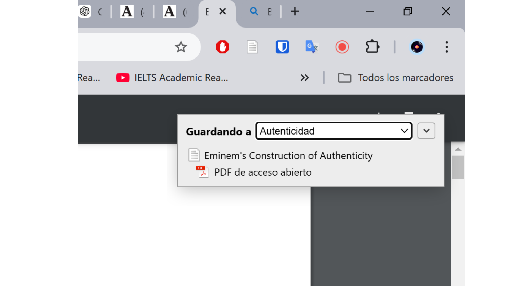
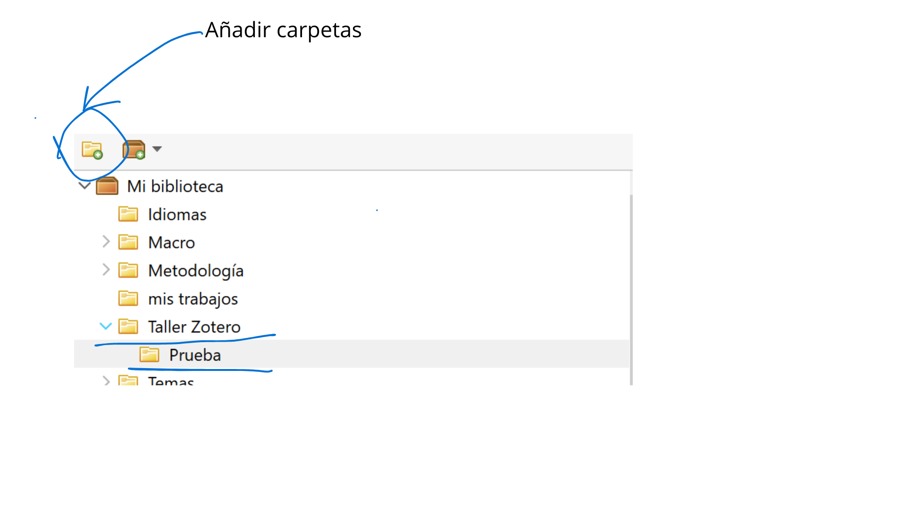

---
output:
  xaringan::moon_reader:
    css: ["xaringan-themer.css", "custom.css"]  # Se añade custom.css aquí
    nature:
      slideNumberFormat: "%current%"
      highlightStyle: github
      highlightLines: true
      ratio: 16:9
      countIncrementalSlides: true
      font-family: "Outfit, Arial, sans-serif"
---


```{r xaringan-themer, include=FALSE, warning=FALSE}
library(xaringanExtra)
library(xaringanthemer)
style_mono_accent(
  base_color = "black",
  header_font_google = google_font("Josefin Sans"),
  text_font_google   = google_font("Montserrat", "300", "300i"),
  code_font_google   = google_font("Fira Mono"), 
  base_font_size = "30px", # Ajuste del tamaño global de la fuente
)

# Crear un archivo CSS para personalizar inverse y citas
css_code <- "
.inverse strong { color: #b0b0b0 !important; } /* Texto en negrita en gris */
.inverse em { color: #b0b0b0 !important; } /* Texto en cursiva en gris */
.inverse a { color: #b0b0b0 !important; text-decoration: underline; } /* Enlaces en gris */
.inverse a:hover { color: #d0d0d0 !important; } /* Color más claro al pasar el mouse */

/* 🔹 Citas normales */
blockquote {
  color: #555555 !important;  /* Texto en gris oscuro */
  font-style: italic;
  font-size: 1.2em;  /* Aumenta el tamaño */
  border-left: 5px solid #999999; /* Borde lateral gris */
  padding-left: 15px;
  margin-left: 20px;
}

/* 🔹 Citas en inverse */
.inverse blockquote {
  color: #bbbbbb !important;  /* Texto más claro */
  border-left: 4px solid #d0d0d0;
}
"

writeLines(css_code, "custom.css") # Guarda el CSS en un archivo


```


```{r xaringan-animate-css, echo=FALSE}
xaringanExtra::use_animate_css()
xaringanExtra::use_tachyons()
xaringanExtra::use_share_again()


```

class: slideInRight, middle, inverse
background-image: url("img/temp/4.png")
background-size: cover

# La gestión bibliográfica con Zotero
## Prof. Sebastián Muñoz-Tapia

---
class: slideInRight, fadeOutLeft, middle


# Bienvenidos al Taller

## Objetivos del Taller

- Comprender las funciones principales de Zotero.
- Organizar y gestionar referencias para proyectos de investigación.
- Trabajar con documentos PDF: anotaciones, notas y traducción.
- Integrar Zotero con Word para la redacción académica.


---
class: slideInRight, fadeOutLeft, middle
background-image: url("img/temp/1.png")
background-size: cover


# Agenda del Taller

0. **Demostración Rápida** 
1. **Configuración Inicial de Zotero** 
2. Gestión de Referencias 
3. Trabajo con PDFs 
4. Interludio: Integración con Obsidian
5. Citas y Bibliografía en Word 
6. Cierre y preguntas

---
class: slideInRight, fadeOutLeft, middle
background-image: url("img/plan.gif")
background-size: cover


---
background-image: url("img/temp/4.png")
background-size: cover
class: slideInRight, fadeOutLeft, middle, inverse
### 쯈ué es Zotero? Demostración Rápida de Gestión bibliográfica

---
class: slideInRight, fadeOutLeft, middle
background-image: url("img/temp/1.png")
background-size: cover

.pull-left[
#### 1. **Agregar Referencias**
   - Busca un artículo en Google Scholar o Scopus.
   - Usa el conector de Zotero para guardarlo directamente.

#### 2. **Organización**
   - Crea una carpeta específica para este tema.
   - Asigna etiquetas (tags) relevantes al documento.]

.pull-right[   
#### 3. **Trabajo con PDFs**
   - Abre el PDF del artículo en Zotero.
   - Subraya una idea importante y agrega una nota explicativa.
   - Usa Zotero PDF Translate para traducir un párrafo clave.

#### 4. **Integración con Word**
   - Abre un documento de Word.
   - Inserta una cita desde Zotero.
   - Genera automáticamente la bibliografía con el estilo APA.]


---

background-image: url("img/zotero.png")
background-size: cover


---
background-image: url("img/temp/4.png")
background-size: cover
class: slideInRight, fadeOutLeft, middle, inverse

### Software de Código Abierto: Ventajas y Desafíos

---
class: slideInRight, fadeOutLeft, middle
background-image: url("img/temp/1.png")
background-size: cover

.pull-left[
#### **Ventajas**
   - Gratuito y accesible para todos.
   - Extensible y personalizable.
   - Mejora constante gracias a la colaboración global.
   - Código abierto para auditoría y modificación.]

.pull-right[
#### **Desafíos**
   - Incompatibilidades entre actualizaciones del software base y extensiones.
   - Dependencia de la comunidad para soporte.
   - Curva de aprendizaje inicial.
   - Extensiones pueden tardar en actualizarse.
]

---
class: slideInRight, fadeOutLeft, middle
background-image: url("img/temp/3.png")
background-size: cover

### **Ejemplo en Zotero**
- **Ventaja:** Desarrollo de extensiones como ZotFile.
- **Problema:** Incompatibilidad de extensiones con versiones recientes.

**Consejo:** Verifica compatibilidades antes de actualizar.


---

background-image: url("img/deseperada.gif")
background-size: cover

class: slideInRight, fadeOutLeft, bottom

## .white[Si no resulta] 
## .white[no desesperen!]

---

background-image: url("img/23.png")
background-size: cover


---
background-image: url("img/temp/4.png")
background-size: cover
class: slideInRight, fadeOutLeft, middle, inverse

### Configuración Inicial de Zotero

---
class: slideInRight, fadeOutLeft, middle
background-image: url("img/temp/3.png")
background-size: cover

### **Paso 1: Instalación de Zotero**
.pull-left[
1. Accede a [zotero.org](https://www.zotero.org/download/).
2. Descarga Zotero para:
   - **Windows**: Ejecuta el instalador y sigue las instrucciones.
   - **Mac**: Arrastra la aplicación a la carpeta "Aplicaciones".
   - **Linux**: Sigue las instrucciones específicas para tu distribución.
   
- .red[Vamos a usar la versión 6! compatible con zotFile!]]
   
.pull-right[ 
 ]


---

background-image: url("img/19.png")
background-size: cover


---
class: slideInRight, fadeOutLeft, middle
background-image: url("img/temp/1.png")
background-size: cover

.pull-left[
### **Paso 2: Instalar el Conector del Navegador**

1. Desde la misma página de Zotero, descarga el **conector** para tu navegador:
   - Disponible para **Chrome**, **Firefox**, **Safari**, o **Edge**.
2. Este conector te permitirá guardar referencias directamente desde páginas web.]


.pull-right[ 
 ]


---
class: slideInRight, fadeOutLeft, middle
background-image: url("img/temp/3.png")
background-size: cover

### **Paso 3: Crear una Cuenta de Zotero**

1. Regístrate en [zotero.org](https://www.zotero.org/) para sincronizar tus datos.
2. Ingresa con tu cuenta desde Zotero:
   - Ve a "Editar > Preferencias > Sincronización".
   - Introduce tus credenciales y activa la sincronización automática.

---
class: slideInRight, fadeOutLeft, middle
background-image: url("img/temp/3.png")
background-size: cover
### **Paso 4: Instalar Extensiones Útiles**

.pull-left[
1. **ZotFile**:
   - Mejora la gestión de PDFs en Zotero.
   - Descarga desde: [ZotFile](http://zotfile.com/).
   - Instálalo desde "Herramientas > Complementos > Instalar complemento desde archivo".]
   
.pull-right[ 
 ]

---
background-image: url("img/3.png")
background-size: cover

class: bottom

## En PC

---

background-image: url("img/20.png")
background-size: cover

class: bottom

## En Mac


---
class: slideInRight, fadeOutLeft, middle
background-image: url("img/temp/3.png")
background-size: cover

#### **1. Instalar ZotFile**

1. Asegúrate de tener Zotero instalado en tu computadora.
2. Descarga el archivo de extensión `.xpi` desde el sitio oficial de ZotFile:
   - Ve al enlace de descarga y haz clic en el archivo `.xpi` de la versión más reciente.
3. Abre Zotero y sigue estos pasos:
   - Dirígete a **Herramientas -> Complementos -> Herramientas para todos los complementos** (el pequeño engranaje en la esquina superior derecha).
   - Selecciona **Instalar complemento desde archivo** y elige el archivo `.xpi` que descargaste.

---
class: slideInRight, fadeOutLeft, middle
background-image: url("img/temp/1.png")
background-size: cover

.pull-left[
#### **2. Cambiar la Carpeta de Origen para Archivos Nuevos**

1. ZotFile utiliza la carpeta especificada por el usuario para adjuntar los archivos más recientes (por ejemplo, los recién descargados).
2. Para configurar esto en Zotero:
   - Ve a **Herramientas -> Preferencias de ZotFile -> Configuración General**.
   - Cambia la carpeta de origen al directorio de descargas de tu navegador (por ejemplo, `~/Downloads` en Mac o "Descargas" en Windows).]
   
- .red[Cree una carpeta en su computador específica para los textos!]   
   
.pull-right[ 
 ]

---

background-image: url("img/4.png")
background-size: cover

---
class: slideInRight, fadeOutLeft, middle
background-image: url("img/temp/1.png")
background-size: cover

#### **3. Cambiar otras Opciones (opcional)**

1. ZotFile ofrece varias opciones adicionales configurables por el usuario.
2. Estas opciones se encuentran en:
   - **Herramientas -> Preferencias de ZotFile.**
3. Personaliza según tus necesidades, como:
   - Renombrar automáticamente archivos PDF.
   - Organizar carpetas de manera personalizada.
   - Mover archivos adjuntos a ubicaciones específicas.
   
---
class: slideInRight, fadeOutLeft, middle
background-image: url("img/temp/3.png")
background-size: cover

#### **Resumen Rápido: ZotFile**

- **Funcionalidad clave:** Gestiona archivos adjuntos (PDFs) de manera eficiente.
- **Ventajas:**
   - Organización automática de PDFs.
   - Mayor control sobre la ubicación y nombres de los archivos.
   - Integra de forma nativa con Zotero.
---

background-image: url("img/5.png")
background-size: cover

---
class: slideInRight, fadeOutLeft, middle
background-image: url("img/temp/1.png")
background-size: cover

#### **Paso 4: Instalar Extensiones Útiles**

2. **Zotero PDF Translate**:
   - Permite traducir textos directamente en los PDFs.
   - Instálalo desde: [GitHub - Zotero PDF Translate](https://github.com/windingwind/zotero-pdf-translate/releases/tag/v1.0.25).
   
   
---
class: slideInRight, fadeOutLeft, middle
background-image: url("img/temp/3.png")
background-size: cover


.pull-left[
#### **Práctica: Configuración Inicial**

1. **Descarga Zotero** y asegúrate de tenerlo instalado.
2. **Instala el conector de tu navegador** (según tu preferencia).
3. **Sincroniza tu cuenta** para almacenar tus datos en la nube.
4. **Instala Extensions**

쯊ienes algún problema con la instalación? 춰Levanta la mano!]

.pull-right[
 
]


---

background-image: url("img/24.png")
background-size: cover


---
class: slideInRight, fadeOutLeft, middle
background-image: url("img/temp/1.png")
background-size: cover

.pull-left[
### Organización de Referencias

#### **Carpetas **

- **Carpetas temáticas:** Organiza referencias por proyecto o capítulo.
1. Cree una carpeta para un tema de interés: taller zotero
2. Cree subcarpetas: prueba ]

.pull-right[
 
]

---
background-image: url("img/11.png")
background-size: cover


---
background-image: url("img/temp/4.png")
background-size: cover
class: slideInRight, fadeOutLeft, middle, inverse

### Gestión de Referencias
#### 쮺칩mo importar referencias? 

---
class: slideInRight, fadeOutLeft, middle
background-image: url("img/temp/1.png")
background-size: cover

.pull-left[
#### 1. Si se puede mediante:
- **ISBN (International Standard Book Number)**
  - Identificador único para libros y publicaciones.
  - Ejemplo: `978-3-16-148410`.
- **DOI (Digital Object Identifier)**
  - Identificador único para recursos digitales como artículos o datasets.
  - Ejemplo: `10.1000/xyz123`.
- **URL (Uniform Resource Locator)**
  - Dirección web para localizar recursos en línea.
  - Ejemplo: `https://www.zotero.org/`.

]

.pull-right[
 
**Importancia:** Estos identificadores son clave para agregar y organizar referencias en Zotero.
]


---
background-image: url("img/libroenpapel.jpg")
background-size: contain
background-position: center
background-repeat: no-repeat
---
background-image: url("img/6.png")
background-size: cover


---
class: slideInRight, fadeOutLeft, middle
###  **Integración de Textos**

#### Pasos:

1. Descarga [este libro](https://ia800206.us.archive.org/14/items/durkheim_emile_-_las_reglas_del_metodo_sociologico_0/durkheim_emile_-_las_reglas_del_metodo_sociologico_0.pdf).
2. Integralo a tu biblioteca
3. Completa los metadatos:
   - Título, autor, año de publicación.
   - Probar ISBN: 968-16-2445-9

---

background-image: url("img/7.png")
background-size: cover
   

---
class: slideInRight, fadeOutLeft, middle
background-image: url("img/temp/3.png")
background-size: cover

#### 2. A través de documentos locales (PDFs o libros físicos).
- [Articulo](https://journals.sagepub.com/doi/abs/10.1177/1748048520928254): saco su DOI
- [Descargo](https://sci-hub.se/): mediante su DOI
- Guardo en Zotero
- Modifico su Metadata: Importancia del tipo de Documento! (distintos datos)
- Cambia donde está: Rename and Move (Botón Derecho)
- Observo si esta en la carpeta que yo designé. 
- Boton derecho o dos dedos al mismo tiempo para seleccionar categorias: autor, año, título, numero de citaciones. 

---
background-image: url("img/9.png")
background-size: cover


---
background-image: url("img/10.png")
background-size: cover


---

class: slideInRight, fadeOutLeft, middle
background-image: url("img/temp/3.png")
background-size: cover

.pull-left[
#### **Práctica: Integración de Textos**

1. Busca un artículo en Google Scholar.
2. Usa la opción de exportar cita a Zotero o integralo.
3. Completa los metadatos:
   - Título, autor, año de publicación.
4. Remombra y ve si está en la carpeta que tu configuraste.  ]


.pull-right[

]


---
background-image: url("img/25.png")
background-size: cover


---

class: slideInRight, fadeOutLeft, middle
background-image: url("img/temp/1.png")
background-size: cover

### Trabajo con PDFs (Doble click al texto)
.pull-left[
#### **Herramientas Clave**

1. Subrayado de ideas clave.
2. Inserción de notas contextuales.
3. Uso de Zotero PDF Translate para traducir fragmentos.]

.pull-right[

]

---
background-image: url("img/12.png")
background-size: cover


---
class: slideInRight, fadeOutLeft, middle
background-image: url("img/temp/3.png")
background-size: cover

## 쯈ué pasa si el texto no se puede subrayar?
#### Usar OCR (Reconocimiento Óptico de Caracteres)
- Tecnología que permite convertir texto en imágenes escaneadas o documentos PDF en texto editable y buscable.
- Utiliza algoritmos avanzados para identificar caracteres, palabras y estructuras de texto.
- Una opción es **[esta](https://tools.pdf24.org/es)**: busquen OCR en la lupa. 

---


background-image: url("img/13.png")
background-size: cover

## Notas y traducciones

- Use el texto del K-pop

---


background-image: url("img/14.png")
background-size: cover

## Emprolijar via ChatGPT


---

background-image: url("img/21.png")
background-size: cover


---

background-image: url("img/22.png")
background-size: cover

class: slideInRight, fadeOutLeft, middle

.pull-right[

## Generación rápida de Ficha]

---
class: slideInRight, fadeOutLeft, middle
background-image: url("img/temp/1.png")
background-size: cover

.pull-left[
#### **Práctica: Trabajo con PDFs**

1. Abre un PDF desde Zotero.
2. Subraya una frase importante.
3. Agrega una nota explicativa.
4. Traduce un fragmento usando Zotero PDF Translate.
5. Genere una ficha y guardela]

.pull-right[

]


---

background-image: url("img/temp/4.png")
background-size: cover
class: slideInRight, fadeOutLeft, middle, inverse

## Bonus: 쮺칩mo tomar notas y resumir activamente un texto? - Búsquen ustedes!

---
class: slideInRight, fadeOutLeft, middle
background-image: url("img/temp/1.png")
background-size: cover

.pull-left[
### 1. Método Cornell
- Diseñado para tomar notas de forma organizada y eficiente.
- Estructura:
  - Columna izquierda: Ideas principales o preguntas clave.
  - Columna derecha: Detalles, explicaciones o respuestas.
  - Parte inferior: Resumen general de la página.
- Ventaja: Facilita la revisión rápida y la comprensión de los conceptos clave.]


.pull-right[
### 2. Método Zettelkasten
- Sistema basado en fichas o notas conectadas.
- Proceso: (1)Cada idea o concepto se escribe en una ficha independiente; (2) Las fichas se relacionan entre sí mediante referencias cruzadas; (3) Utiliza categorías amplias y etiquetas para agrupar ideas.
- Ventaja: Promueve la conexión entre ideas y fomenta el pensamiento crítico.]

---
background-image: url("img/explicacion.png")
background-size: cover
class: slideInRight, fadeOutLeft, bottom, inverse

.yellow[
## Integración con Obsidian 
### 쯇or qué usar Obsidian? 쮺칩mo ordenar nuestros textos e ideas?
- Para sistematizar notas y fichas de lectura.
- Exportar referencias desde Zotero. ]

## [descarga Obsidian acá](https://obsidian.md/)

---
background-image: url("img/15.png")
background-size: cover


---
background-image: url("img/26.png")
background-size: cover

---

class: slideInRight, fadeOutLeft, middle
background-image: url("img/temp/3.png")
background-size: cover

#### Citas y Bibliografía en Word
##### **Exposición: Configuración y Formato**

1. Selección del estilo de cita (APA, Chicago, etc.).
2. Inserción de citas en texto.
3. Generación automática de bibliografía.]


---
background-image: url("img/16.png")
background-size: cover

---
background-image: url("img/17.png")
background-size: cover

---
background-image: url("img/18.png")
background-size: cover

---
class: slideInRight, fadeOutLeft, middle
background-image: url("img/temp/1.png")
background-size: cover

.pull-left[
## **Práctica: Citas en Word**

1. Abre un documento en Word.
2. Inserta una cita usando Zotero.
3. Inserte una cita con número de página
4. Inserte una cita con la forma: según Muñoz (2015) se puede entender que...
3. Genera automáticamente la bibliografía.]

.pull-righ[


]


---
background-image: url("img/end.gif")
background-size: cover

class: slideInRight, fadeOutLeft, bottom
### Cierre y Preguntas

.red[
- 쯈ué funciones te parecieron más útiles?
- 쯊ienes dudas sobre algún paso?

- Recomendación final:
Explora Zotero para todos tus proyectos académicos y sigue experimentando con nuevas extensiones.
]