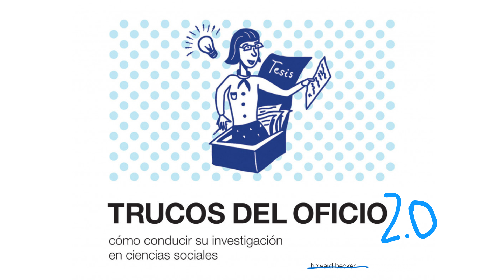

### Bienvenidxs al curso Trucos del Oficio.

| Profesor           | email                       | 
|--------------------|-----------------------------|
| Sebastián Muñoz    | sebastianmunozt@gmail.com |

# Cronograma del Curso

| Fecha       | Clase Tentativa | Tema                                                                                                         | Evaluaciones/Tareas                                                    | Materiales |
|------------|---------------|-------------------------------------------------------------------------------------------------------------|------------------------------------------------------------------------|------------|
| **13/03/2025** | 1-a           | Metodología y Cronograma; Presentaciones                                                                |                                                                        |            |
|            | 1-b           | Tecnologías digitales, economía de la atención y subjetividad actual                                     |                                                                        |            |
| **20/04/2025** | 2-a           | GTD y MakeTime: Dos formas de administrar tu tiempo                                                   | **Tarea:** Exposición aleatoria de temas                               |            |
|            | 2-b           | Ordenar tus entradas (correo, WhatsApp, notas), ordenar tus días (Horario y Google Calendar), ordenar tus tareas (TickTick) |                                                                        |            |
| **27/03/2025** | 3-a           | Focalízate en tu estudio: Pomodoro, Audio; Taller: ordena tu correo, tus días y tareas, reflexiona y evalúa tu orden personal | **Tarea:** Mostrar horario, Google Calendar y método de focalización   |            |
|            | 3-b           | Método Zettelkasten o cómo Luhmann escribió tanto en tan poco; Ordenar tu vida con Obsidian (o Notion)     |                                                                        |            |
| **03/04/2025** | 4-a           | Markdown: para Obsidian y ChatGPT                                                                      | **Tarea:** Mostrar los resultados/reflexiones de tu orden personal     |            |
|            | 4-b           | Taller 3: Genera tu Vault                                                                               |                                                                        |            |
| **10/04/2025** | 5-a           | ¿Qué es, cómo funciona y cuáles son los sesgos de la IA generativa?                                 | **Tarea:** Mostrar el Vault                                            |            |
|            | 5-b           | Hacer buenos prompts; Taller: realización de prompts y búsqueda de sesgos                             |                                                                        |            |
| **17/04/2025** | -             | **Feriado Semana Santa** 🏖️                                                                          |                                                                        |            |
| **24/04/2025** | 6-a           | Generación de ideas; Uso de AudioPen; Los géneros académicos                                        | **Tarea:** Mostrar prompts y los sesgos encontrados                    |            |
|            | 6-b           | ChatGPT: Generar un esquema para la investigación; Búsqueda de palabras claves (keywords), conceptos y perspectivas principales |                                                                        |            |
| **01/05/2025** | -             | **Receso de clases para estudiantes** 🏖️                                                              |                                                                        |            |
| **08/05/2025** | 7-a           | Problematizar y pregunta(s) de investigación 1; Taller: (a) Genera un esquema inicial de investigación, encuentra palabras claves, conceptos y perspectivas principales; (b) Ordénalas en un problema | **Tarea:** Mostrar esquema de investigación, keywords, conceptos y perspectivas principales |            |
|            | 7-b           | Repaso general                                                                                        |                                                                        |            |
| **15/05/2025** | 8-a           | **📢 Presentaciones de estudiantes 1 - Intermedia**                                                  | **Evaluación: 30%**                                                     |            |
|            |               | Organización personal, ideas de investigación, usos de prompts para: keywords, conceptos y perspectivas, problema de investigación |                                                                        |            |
|            | 8-b           | Búsquedas avanzadas: WoS, Scielo; Google Scholar; Taller: búsqueda 1 "El colector"                      |                                                                        |            |
| **22/05/2025** | 9-a           | Zotero                                                                                              | **Tarea:** Mostrar búsquedas en WoS, Scielo, Google Scholar            |  [`PPT`](https://sebastianmunozt.github.io/trucos_del_oficio/Zotero/zotero#1) [`Curso YT`](https://www.youtube.com/watch?v=p9Rd50xl0Wo&list=PLnAYjzn3hPIZhCm1971ojS2JxafnO8NFb&ab_channel=Miguel%C3%81lvarez)             |
|            | 9-b           | Taller: Gestiona tu bibliografía base                                                                 |                                                                        |            |
| **29/05/2025** | 10-a          | Sci-Space y LitMaps; Taller: Búsqueda 2 "El detective"                                             | **Tarea:** Mostrar búsquedas, orden y el proceso en Zotero             |            |
|            | 10-b          | Filtrar lo más importante en LitMaps; Taller: Cómo seleccionar artículos                             |                                                                        |            |
| **05/06/2025** | 11-a          | Estructura de un artículo; De Zotero a Obsidian; Resumen inicial con Sci-Space                     | **Tarea:** Mostrar búsquedas en Sci-Space y LitMap, jerarquización final de 10 textos |            |
|            | 11-b          | Taller de construcción de fichas                                                                      |                                                                        |            |
| **12/06/2025** | 12-a          | Mapas conceptuales; Ordena tus notas con ChatGPT; Problematiza y desarrolla tu problema(s) de investigación 2.0 (recargado) | **Tarea:** Mostrar fichas en Obsidian                                   |            |
|            | 12-b          | Argumentar en ciencias sociales; El proceso de escritura                                            |                                                                        |            |
| **19/06/2025** | 13-a          | Zotero: Incluye tu bibliografía; La edición; La asistencia de ChatGPT                            | **Tarea:** Mostrar un mapa conceptual para armar tu revisión bibliográfica |            |
|            | 13-b          | Taller: Incluye tu bibliografía, apuntes y ordénalos con ChatGPT                                    |                                                                        |            |
| **26/06/2025** | 14-a y 14-b  | **📢 Presentaciones de estudiantes 2 - Final**                                                     | **Evaluación: 40%**                                                     |            |
|            |               | - Descripción del proceso de gestión bibliográfica                                                   |                                                                        |            |
|            |               | - Problematización recargada                                                                         |                                                                        |            |
|            |               | - Entrega de texto (máximo 10 páginas) con problematización (pregunta, objetivos) y revisión bibliográfica (estado del arte) | **(20% presentación, 20% texto)**                                      |            |
|            |               | **Asistencia:** 15%                                                                                  |                                                                        |            |
|            |               | **Participación:** 15%                                                                              |                                                                        |            |
|            |               | **Total:** 100%                                                                                      |                                                                        |            |

