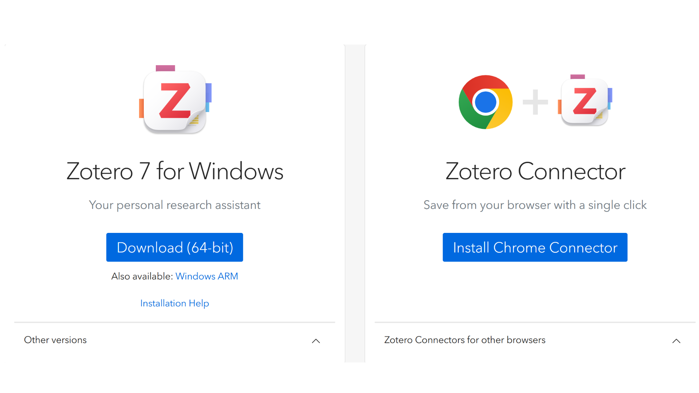
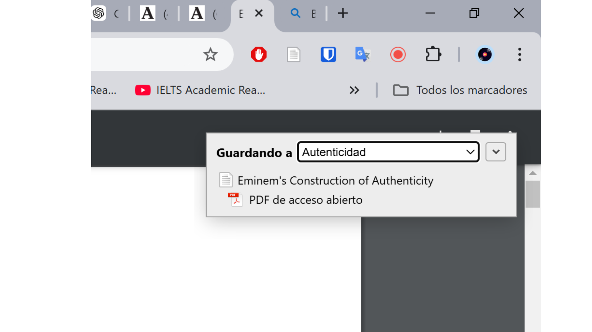
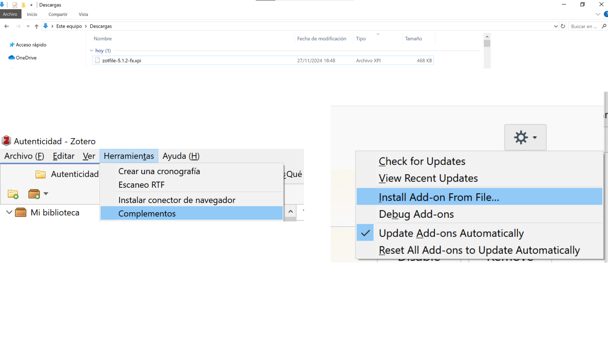
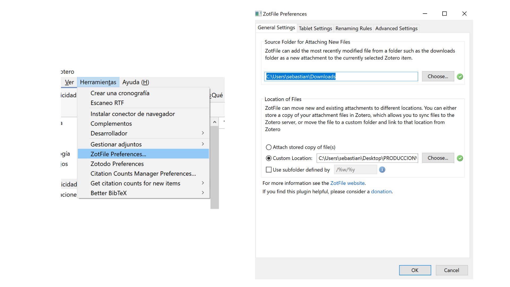
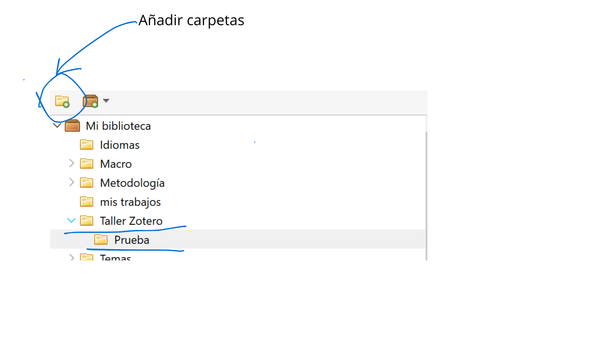
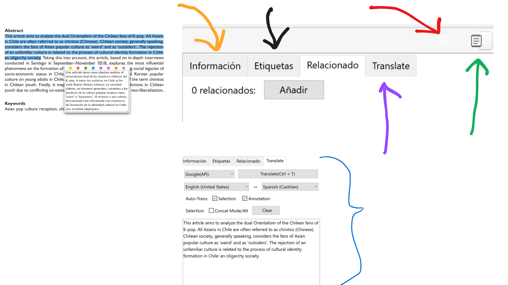

---
title: "Taller Zotero para la gestión bibliográfica"
author: "Sebastián Muñoz-Tapia"
output:
  xaringan::moon_reader:
    css: xaringan-themer.css
    nature:
      slideNumberFormat: "%current%"
      highlightStyle: github
      highlightLines: true
      ratio: 16:9
      countIncrementalSlides: true
      font-family: "Outfit, Arial, sans-serif"
---


```{r xaringan-themer, include=FALSE, warning=FALSE}
library(xaringanExtra)
library(xaringanthemer)
style_mono_accent(
  base_color = "#1c5253",
  header_font_google = google_font("Josefin Sans"),
  text_font_google   = google_font("Montserrat", "300", "300i"),
  code_font_google   = google_font("Fira Mono")
)

```


```{r xaringan-animate-css, echo=FALSE}
xaringanExtra::use_animate_css()
xaringanExtra::use_tachyons()
xaringanExtra::use_share_again()


```


class: slideInRight, fadeOutLeft, middle


# Bienvenidos al Taller

## Objetivos del Taller

- Comprender las funciones principales de Zotero.
- Organizar y gestionar referencias para proyectos de investigación.
- Trabajar con documentos PDF: anotaciones, notas y traducción.
- Integrar Zotero con Word para la redacción académica.

-mail: sebastianmunozt@gmail.com

---

class: slideInRight, fadeOutLeft, middle

.pull-left[
# Agenda del Taller

0. **Demostración Rápida** (10 min)
1. **Configuración Inicial de Zotero** (15 min)
2. Gestión de Referencias (20 min)
3. Trabajo con PDFs (20 min)
4. Interludio: Integración con Obsidian (5 min)
5. Citas y Bibliografía en Word (25 min)
6. Cierre y preguntas (5 min)]

.pull-right[ 


]
---

class: slideInRight, fadeOutLeft
# Demostración Rápida: Flujos de Trabajo en Zotero

.pull-left[
#### 1. **Agregar Referencias**
   - Busca un artículo en Google Scholar o Scopus.
   - Usa el conector de Zotero para guardarlo directamente.

#### 2. **Organización**
   - Crea una carpeta específica para este tema.
   - Asigna etiquetas (tags) relevantes al documento.]

.pull-right[   
#### 3. **Trabajo con PDFs**
   - Abre el PDF del artículo en Zotero.
   - Subraya una idea importante y agrega una nota explicativa.
   - Usa Zotero PDF Translate para traducir un párrafo clave.

#### 4. **Integración con Word**
   - Abre un documento de Word.
   - Inserta una cita desde Zotero.
   - Genera automáticamente la bibliografía con el estilo APA.]


---


class: slideInRight, fadeOutLeft
# Software de Código Abierto: Ventajas y Desafíos

.pull-left[
### **Ventajas**
- Gratuito y accesible para todos.
- Extensible y personalizable.
- Mejora constante gracias a la colaboración global.
- Código abierto para auditoría y modificación.

### **Desafíos**
- Incompatibilidades entre actualizaciones del software base y extensiones.
- Dependencia de la comunidad para soporte.
- Curva de aprendizaje inicial.
- Extensiones pueden tardar en actualizarse.
]

.pull-right[
### **Ejemplo en Zotero**
- **Ventaja:** Desarrollo de extensiones como ZotFile.
- **Problema:** Incompatibilidad de extensiones con versiones recientes.

**Consejo:** Verifica compatibilidades antes de actualizar.
]


---

background-image: url("img/deseperada.gif")
background-size: cover

class: slideInRight, fadeOutLeft, bottom

## .white[Si no resulta] 
## .white[no desesperen!]

---

class: slideInRight, fadeOutLeft
# Configuración Inicial de Zotero

## **Paso 1: Instalación de Zotero**

.pull-left[
1. Accede a [zotero.org](https://www.zotero.org/download/).
2. Descarga Zotero para tu sistema operativo:
   - **Windows**: Ejecuta el instalador y sigue las instrucciones.
   - **Mac**: Arrastra la aplicación a la carpeta "Aplicaciones".
   - **Linux**: Sigue las instrucciones específicas para tu distribución.
   
- .red[Vamos a usar la versión 6! compatible con zotFile!]]
   
.pull-right[ 
 ]

---

class: slideInRight, fadeOutLeft. middle

.pull-left[
## **Paso 2: Instalar el Conector del Navegador**

1. Desde la misma página de Zotero, descarga el **conector** para tu navegador:
   - Disponible para **Chrome**, **Firefox**, **Safari**, o **Edge**.
2. Este conector te permitirá guardar referencias directamente desde páginas web.]


.pull-right[ 
 ]


---

class: slideInRight, fadeOutLeft, middle
## **Paso 3: Crear una Cuenta de Zotero**

1. Regístrate en [zotero.org](https://www.zotero.org/) para sincronizar tus datos.
2. Ingresa con tu cuenta desde Zotero:
   - Ve a "Editar > Preferencias > Sincronización".
   - Introduce tus credenciales y activa la sincronización automática.

---

class: slideInRight, fadeOutLeft, middle
## **Paso 4: Instalar Extensiones Útiles**

.pull-left[
1. **ZotFile**:
   - Mejora la gestión de PDFs en Zotero.
   - Descarga desde: [ZotFile](http://zotfile.com/).
   - Instálalo desde "Herramientas > Complementos > Instalar complemento desde archivo".]
   
.pull-right[ 
 ]

---
background-image: url("img/3.png")
background-size: cover


---
class: slideInRight, fadeOutLeft, middle
# Cómo Instalar y Configurar ZotFile

### **1. Instalar ZotFile**

1. Asegúrate de tener Zotero instalado en tu computadora.
2. Descarga el archivo de extensión `.xpi` desde el sitio oficial de ZotFile:
   - Ve al enlace de descarga y haz clic en el archivo `.xpi` de la versión más reciente.
3. Abre Zotero y sigue estos pasos:
   - Dirígete a **Herramientas -> Complementos -> Herramientas para todos los complementos** (el pequeño engranaje en la esquina superior derecha).
   - Selecciona **Instalar complemento desde archivo** y elige el archivo `.xpi` que descargaste.

---

class: slideInRight, fadeOutLeft, middle
.pull-left[
### **2. Cambiar la Carpeta de Origen para Archivos Nuevos**

1. ZotFile utiliza la carpeta especificada por el usuario para adjuntar los archivos más recientes (por ejemplo, los recién descargados).
2. Para configurar esto en Zotero Standalone:
   - Ve a **Herramientas -> Preferencias de ZotFile -> Configuración General**.
   - Cambia la carpeta de origen al directorio de descargas de tu navegador (por ejemplo, `~/Downloads` en Mac o "Descargas" en Windows).]
   
#### .red[CREE UNA CARPETA EN SU COMPUTADOR DONDE DEJARÁ SUS TEXTOS!]   
   
.pull-right[ 
 ]

---

background-image: url("img/4.png")
background-size: cover

---

class: slideInRight, fadeOutLeft, middle
### **3. Cambiar otras Opciones (opcional)**

1. ZotFile ofrece varias opciones adicionales configurables por el usuario.
2. Estas opciones se encuentran en:
   - **Herramientas -> Preferencias de ZotFile.**
3. Personaliza según tus necesidades, como:
   - Renombrar automáticamente archivos PDF.
   - Organizar carpetas de manera personalizada.
   - Mover archivos adjuntos a ubicaciones específicas.

### **Resumen Rápido: ZotFile**

- **Funcionalidad clave:** Gestiona archivos adjuntos (PDFs) de manera eficiente.
- **Ventajas:**
   - Organización automática de PDFs.
   - Mayor control sobre la ubicación y nombres de los archivos.
   - Integra de forma nativa con Zotero.
---

background-image: url("img/5.png")
background-size: cover

---

class: slideInRight, fadeOutLeft, middle
## **Paso 4: Instalar Extensiones Útiles**

2. **Zotero PDF Translate**:
   - Permite traducir textos directamente en los PDFs.
   - Instálalo desde: [GitHub - Zotero PDF Translate](https://github.com/windingwind/zotero-pdf-translate/releases/tag/v1.0.25).
   
   

3. **Zotero Citation Counts Manager**:
   - Permite visualizar y actualizar automáticamente las métricas de citas de tus referencias.
   - Descarga desde: [GitHub - Zotero Citation Counts Manager](https://github.com/eschnett/zotero-citationcounts).


---

class: slideInRight, fadeOutLeft, middle

.pull-left[
## **Práctica: Configuración Inicial**

### Tarea:

1. **Descarga Zotero** y asegúrate de tenerlo instalado.
2. **Instala el conector de tu navegador** (según tu preferencia).
3. **Sincroniza tu cuenta** para almacenar tus datos en la nube.
4. **Instala Extensions**

¿Tienes algún problema con la instalación? ¡Levanta la mano!]

.pull-right[
 
]


---

class: slideInRight, fadeOutLeft. middle
.pull-left[
# Organización de Referencias

### **Carpetas **

- **Carpetas temáticas:** Organiza referencias por proyecto o capítulo.
### Tarea
1. Cree una carpeta para un tema de interés: taller zotero
2. Cree subcarpetas: prueba ]

.pull-right[
 
]

---
background-image: url("img/11.png")
background-size: cover


---

class: slideInRight, fadeOutLeft, middle

# Gestión de Referencias
### ¿Cómo importar referencias? 
.pull-left[
#### 1. A través de ISBN, DOI o URL (desde 0), si es que se puede!
- **ISBN (International Standard Book Number)**
  - Identificador único para libros y publicaciones.
  - Ejemplo: `978-3-16-148410-0`.
- **DOI (Digital Object Identifier)**
  - Identificador único para recursos digitales como artículos o datasets.
  - Ejemplo: `10.1000/xyz123`.
- **URL (Uniform Resource Locator)**
  - Dirección web para localizar recursos en línea.
  - Ejemplo: `https://www.zotero.org/`.

]

.pull-right[
 
**Importancia:** Estos identificadores son clave para agregar y organizar referencias en Zotero.
]


---
background-image: url("img/libroenpapel.jpg")
background-size: contain
background-position: center
background-repeat: no-repeat
---
background-image: url("img/6.png")
background-size: cover


---
class: slideInRight, fadeOutLeft, middle
##  **Integración de Textos**

### Pasos:

1. Descarga [este libro](https://ia800206.us.archive.org/14/items/durkheim_emile_-_las_reglas_del_metodo_sociologico_0/durkheim_emile_-_las_reglas_del_metodo_sociologico_0.pdf).
2. Integralo a tu biblioteca
3. Completa los metadatos:
   - Título, autor, año de publicación.
   - Probar ISBN: 968-16-2445-9

---

background-image: url("img/7.png")
background-size: cover
   

---
class: slideInRight, fadeOutLeft. middle

#### 2. A través de documentos locales (PDFs o libros físicos).
- [Articulo K-pop](https://journals.sagepub.com/doi/abs/10.1177/1748048520928254): saco su DOI
- [Descargo](https://sci-hub.se/): mediante su DOI
- Guardo en Zotero
- Modifico su Metadata: Importancia del tipo de Documento! (distintos datos)
- Cambia donde está: Rename and Move (Botón Derecho)
- Observo si esta en la carpeta que yo designé. 

---
background-image: url("img/9.png")
background-size: cover


---
background-image: url("img/10.png")
background-size: cover


---

class: slideInRight, fadeOutLeft, middle

.pull-left[
## **Práctica: Integración de Textos**

### Tarea:

1. Busca un artículo en Google Scholar.
2. Usa la opción de exportar cita a Zotero o integralo.
3. Completa los metadatos:
   - Título, autor, año de publicación.
4. Remombra y ve si está en la carpeta que tu configuraste.  ]


.pull-right[

]


---

class: slideInRight, fadeOutLeft, middle
# Trabajo con PDFs (Doble click al texto)
.pull-left[
## **Herramientas Clave**

1. Subrayado de ideas clave.
2. Inserción de notas contextuales.
3. Uso de Zotero PDF Translate para traducir fragmentos.]

.pull-right[

]

---
background-image: url("img/12.png")
background-size: cover


---

class: slideInRight, fadeOutLeft
# ¿Qué pasa si el texto no se puede subrayar?
### Usar OCR (Reconocimiento Óptico de Caracteres)
#### **¿Qué es OCR?**
- Tecnología que permite convertir texto en imágenes escaneadas o documentos PDF en texto editable y buscable.
- Utiliza algoritmos avanzados para identificar caracteres, palabras y estructuras de texto.
- Una opción es [esta](https://tools.pdf24.org/es): busquen OCR en la lupa. 

---


background-image: url("img/13.png")
background-size: cover

## Notas y traducciones

- Use el texto del K-pop

---


background-image: url("img/14.png")
background-size: cover

## Emprolijar via ChatGPT


---

class: slideInRight, fadeOutLeft, middle

.pull-left[
## **Práctica: Trabajo con PDFs**

### Tarea:

1. Abre un PDF desde Zotero.
2. Subraya una frase importante.
3. Agrega una nota explicativa.
4. Traduce un fragmento usando Zotero PDF Translate.]

.pull-right[

]

---
background-image: url("img/explicacion.png")
background-size: cover
class: slideInRight, fadeOutLeft, bottom, inverse

.yellow[
## Integración con Obsidian (Interludio)
### ¿Por qué usar Obsidian? ¿Cómo ordenar nuestros textos e ideas?
- Para sistematizar notas y fichas de lectura.
- Exportar referencias desde Zotero. ]

## [descarga Obsidian acá](https://obsidian.md/)

---
background-image: url("img/15.png")
background-size: cover


---

class: slideInRight, fadeOutLeft, middle
# Citas y Bibliografía en Word
.pull-left[
## **Exposición: Configuración y Formato**

1. Selección del estilo de cita (APA, Chicago, etc.).
2. Inserción de citas en texto.
3. Generación automática de bibliografía.]


---
background-image: url("img/16.png")
background-size: cover

---
background-image: url("img/17.png")
background-size: cover

---
background-image: url("img/18.png")
background-size: cover

---

class: slideInRight, fadeOutLeft, middle

.pull-left[
## **Práctica: Citas en Word**

### Última Tarea:

1. Abre un documento en Word.
2. Inserta una cita usando Zotero.
3. Inserte una cita con número de página
4. Inserte una cita con la forma: según Muñoz (2015) se puede entender que...
3. Genera automáticamente la bibliografía.]

.pull-righ[


]


---
background-image: url("img/end.gif")
background-size: cover

class: slideInRight, fadeOutLeft, bottom
# Cierre y Preguntas

.red[
- ¿Qué funciones te parecieron más útiles?
- ¿Tienes dudas sobre algún paso?

- Recomendación final:
Explora Zotero para todos tus proyectos académicos y sigue experimentando con nuevas extensiones.

¡Gracias por participar!]